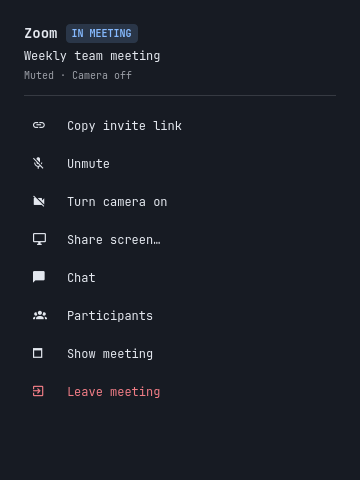

# Zoom Controls for Omarchy

Zoom meeting controls in your Omarchy bar, with Start and Join when you are out
of a meeting. Supports the **English Zoom web app in Chromium**, on Omarchy 4.
The native Zoom desktop application is not supported.



- In a meeting: copy invite link, mute/unmute, camera on/off, share/stop sharing,
  chat, participants, show Zoom, and leave.
- Copy invite link preserves the invite supplied by Zoom, including its host,
  join path, and passcode. Only local Join actions convert links for the web app.
- Outside a meeting: Start meeting, Join meeting (link or ID), Open Zoom, and
  Join copied meeting when the clipboard contains a supported Zoom link.
- Live microphone, camera, and sharing labels; keyboard navigation with arrows
  or j/k, Enter to activate, and Escape to dismiss.
- Leave completes Zoom's confirmation and verifies departure. It never selects
  End Meeting for All. If Zoom requires a host transfer, finish that in Zoom.
- Sharing opens your normal desktop picker. You choose the content there.

## Install

Dependencies: Omarchy 4 (Quickshell shell), Chromium, Node.js 22+, `uwsm`,
`hyprctl`, `iproute2` (`ss`), `wl-clipboard`, Python 3.11+, and a
working systemd user session. Install missing packages using Omarchy's package
manager. No npm packages, Zoom API keys, or browser extensions are required.

From this repository's root, run:

```sh
./install
```

The installer validates and enables `jkarmel.zoom-controls`, keeps a backup of
an existing installer-owned widget, and leaves your preferences and browser data
intact. It resolves system tools to validated absolute paths and rejects symlinked
configuration directories, target folders, markers and source files. Directory
handles remain open throughout staging, validation, replacement and removal;
exclusive renames cannot overwrite an entry that appears during a race. A failed
activation restores the previous package where the target has not been replaced
externally. Unexpected entries and recovery copies are retained instead of deleted.

Use `./install --files-only` to upgrade the files while preserving the current
bar enablement/layout, or for a headless installation. `--remove --files-only`
removes only the owned package without calling the live shell. Running the
installer explicitly opts into the documented package and enable/disable changes;
no preferences or browser profiles are rewritten. When
updating, Omarchy can retain old QML code; run `omarchy restart shell` if needed.
Open the camera icon and choose **Open Zoom**, then sign in once.

The default launcher uses a dedicated profile at
`~/.local/share/zoom-controls/chromium` (respects `XDG_DATA_HOME`). Normal browser
profiles are unaffected. The helper lives inside the plugin; no global helper
installation is needed. Marketplace installs can load the root manifest directly.

## Keep your preferred launcher

Optional settings: `~/.config/zoom-controls/config.json` (respects
`XDG_CONFIG_HOME`). Example:

```json
{
  "profile": "~/path/to/dedicated-zoom-profile",
  "launcher": ["~/bin/my-zoom-launcher", "show"],
  "clipboardCommand": ["~/bin/my-persistent-clipboard-helper"]
}
```

Omit these settings to use the included defaults. `browser` can select a
Chromium-compatible executable. Commands are argument arrays, never shell code;
`~` is expanded at the start of paths. Bare executable names resolve only in
`/usr/bin`; use an absolute path for a custom user script. Executables and their
parent directories must be owned by root or, for explicit overrides, your user,
and must not be writable by other users. The root-owned sticky temporary
directory is allowed as a parent of a private directory. Child commands receive
a small allowlist of session variables and `PATH=/usr/bin`; shell startup,
loader, Python, and Node injection variables are excluded.

A custom launcher must use the configured profile, expose a loopback DevTools listener (`--remote-debugging-port=0`), and
show the existing meeting window without creating duplicate windows. The
clipboard command receives the invite URL on stdin and must retain ownership
after returning. `ZOOM_CONTROLS_CONFIG` selects an alternate config for testing.

## Remove

```sh
./install --remove
```

This disables and removes the widget, retaining preferences and Zoom login data.
You can also disable it with `omarchy plugin disable jkarmel.zoom-controls`.
For an installation made directly by the marketplace, use its removal controls.

## Privacy and limits

The helper connects only to loopback listeners owned by the browser process
using the configured dedicated profile. It reads visible Zoom controls and
rechecks meeting identity before actions. Multiple simultaneous meetings are
reported as ambiguous. Status polling does not focus Zoom or toggle controls.

Remote debugging lets local processes control that dedicated browser profile;
use it for Zoom rather than general browsing. Copied links can contain meeting
passcodes. Status includes only a boolean for clipboard-link availability, not
the URL; clipboard contents are revalidated on click. The built-in clipboard
helper hands off through a private temporary runtime file, which is deleted
as soon as the clipboard service reads it. Link bytes are sent on stdin, not
placed in service command arguments.
Your desktop clipboard history may retain copied links under its own settings.

Zoom UI changes can require selector updates. Waiting rooms, sign-in, meeting
passcodes, host transfer, and other Zoom prompts remain in Zoom. "Opening
meeting" means navigation began, not that admission to the meeting succeeded.
Meeting IDs must contain 9–11 digits. Supported links are HTTPS `zoom.us` links
using `/j/ID`, `/wc/join/ID`, or `/my/name`.

## Execution limits

Each menu poll has an 8-second outer deadline; actions have 60 seconds. Both
collect at most 64 KiB of combined child output before returning bounded JSON
to QML, which also has independent 10/65-second timers. Clipboard commands have
10 seconds. Timeout, excessive output, and termination clean up the supervised
process groups, including nested helper groups in the same private session.
Persistent browser and clipboard ownership services are intentionally separate.
Custom launchers that explicitly detach into another session remain responsible
for those detached processes.

Debug target lists and WebSocket messages are capped at 256 KiB, with at most
64 targets. HTTP redirects are refused. Each page WebSocket must match the
exact discovered loopback host, port, protocol, and target ID. WebSocket frame
lengths and fragmented-message totals are checked before buffering their bodies;
unexpected target, CDP, and page-state schemas are rejected.

These controls bound accidental or malformed responses. They do not sandbox
user-selected scripts or protect against another process with full control of
your account. See [review fixes](docs/SECURITY-REVIEW.md).

## Development

Run `./check` for backend, parser, installer, and QML tests. QML tests render
without opening desktop windows; the software renderer does not validate native
screen pickers. The tests need Chromium and Qt Quick Test tools. See
[QA results](docs/QA.md) for live coverage and remaining limitations.

IPC:

```sh
omarchy-shell zoom-controls status
omarchy-shell zoom-controls actions
omarchy-shell zoom-controls toggle
```

`actions` reports rows loaded by the running menu, useful for verifying updates.
